[← Back to README](README.md)

> **Source note:** This report analyzes a real, captured phishing email sourced from [PhishingPot](https://github.com/rf-peixoto/phishing_pot), an open-source repository of real-world phishing samples. The investigation below is independent original work.

---

# 1. Executive Summary

On 16 April 2026, a phishing email impersonating "Cloud Services" was received, threatening data deletion to pressure the recipient into clicking a fake account-recovery link. This has been confirmed as a **true-positive phishing attempt**: email authentication (SPF/DKIM/DMARC) fails, the sender domain is spoofed, and both the sending and hosting infrastructure trace to ASN AS60781 (LeaseWeb Netherlands), which has an extensive history of hosting phishing and malware campaigns. A file hash tied to related infrastructure also correlates with a CISA advisory (AA26-204a) on Russian state-linked phishing activity, though this should be treated as a moderate-confidence lead rather than confirmed attribution. **Action taken:** sender and hosting IPs blocked at the perimeter; further recommendations are detailed in Section 12.

---

# 2. Incident Overview

- **Date received:** 16 April 2026, 17:12
- **Subject:** "⚠ FINAL NOTICE: Your photos and files are scheduled for deletion – (OFU-104676) ❗"
- **Sender (display name):** "Cloud Services" — `hello@CloudServicesi7t.com`
- **Lure type:** Fake storage/subscription payment-failure notice threatening permanent deletion of photos, backups, and shared work documents
- **Call to action:** "RECOVER MY ACCOUNT NOW" button

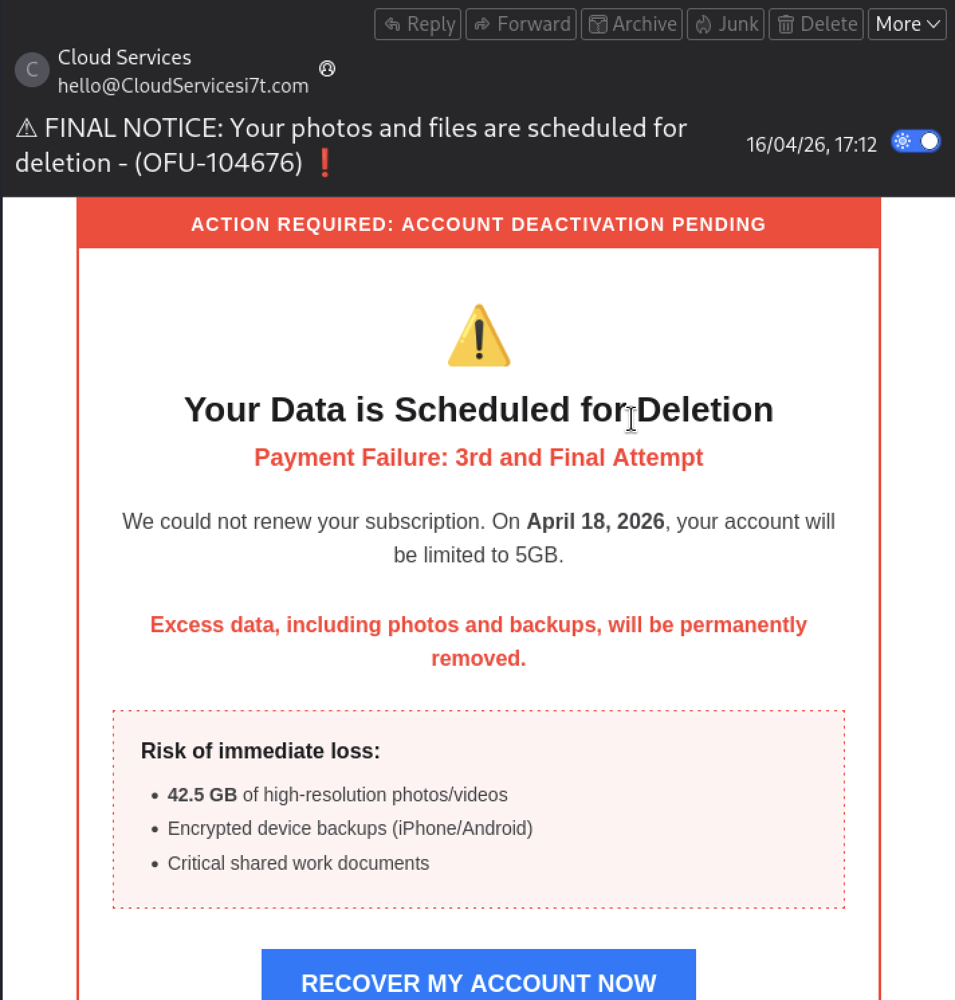
*Fig 2.1 – Phishing email as received*

---

# 3. Initial Triage - Visual & Content Indicators

At first look, several social-engineering indicators stand out:

- Use of urgency language — "FINAL NOTICE", "scheduled for deletion", "permanently removed" — reinforced with red coloring and an "ACTION REQUIRED" banner, designed to create panic and reduce doubt.
- Pseudo-legitimizing details such as a ticket reference ("OFU-104676") and a specific risk statistic ("42.5 GB") intended to make the notice feel authentic.
- A footer citing a company headquarters address, intended to add further legitimacy.

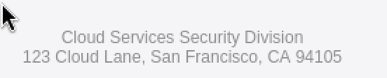
*Fig 3.1 – Footer in the phishing email*

The final psychological lever is the "RECOVER MY ACCOUNT NOW" button, which drives the recipient toward the malicious link under the same sense of urgency.

> This visual and content review alone is a strong initial indicator of phishing. The remainder of the investigation validates this and determines whether escalation is warranted.

---

# 4. Sender Verification

Searching the address and company name cited in the footer ("Cloud Services", 123 Cloud Lane, San Francisco, CA 94105) returns no legitimate, recognized company matching that combination.

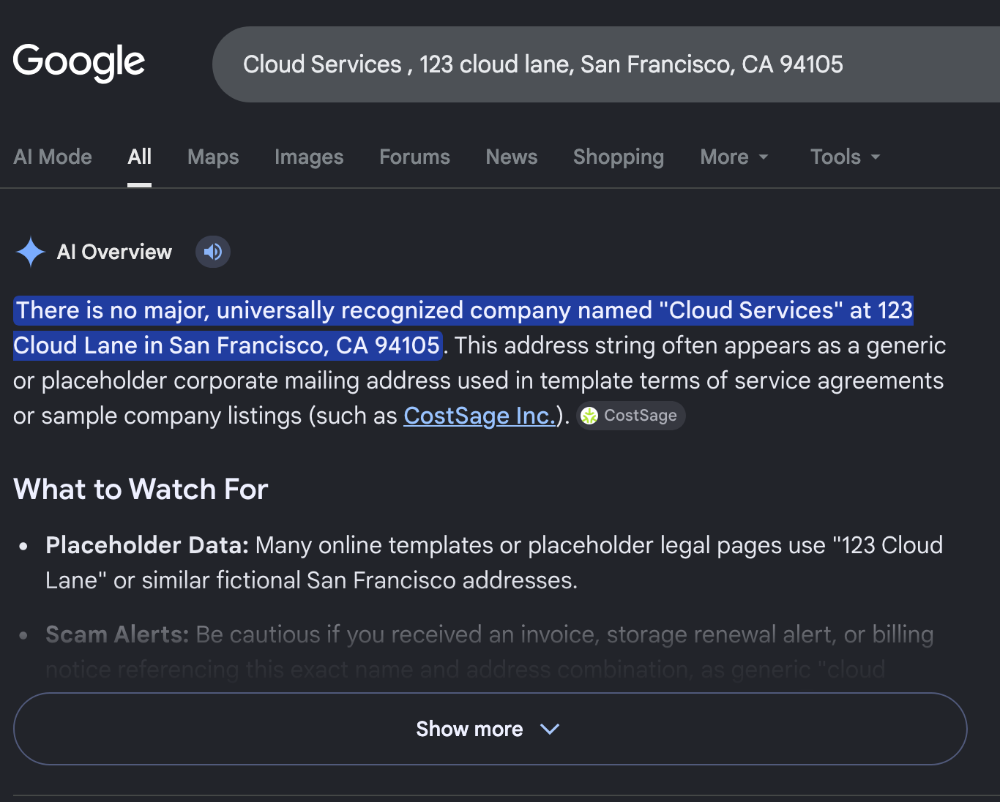
*Fig 4.1 – Google search results for the footer address*


*Fig 4.2 – Other companies ("CloudOrcus", "Cloudcentric") sharing the same placeholder address*

The address is a commonly reused placeholder/template address, and unrelated companies ("CloudOrcus", "Cloudcentric") appear at the same location — confirming "Cloud Services" is not a legitimate entity.

---

# 5. Email Header Analysis

## 5.1 Path Reconstruction

```
terbsx.onmicrosoft.com (62.212.79.196)
   -> Microsoft internal mail servers
   -> SEYPR02CU001.outbound.protection.outlook.com (52.102.202.63) [outbound]
   -> Inbound server -> Received in mailbox
```

Transit time: started Thu, 16 Apr 2026 11:42:54 +0000, ended 11:42:56 +0000 (2 seconds).

## 5.2 Authentication Results

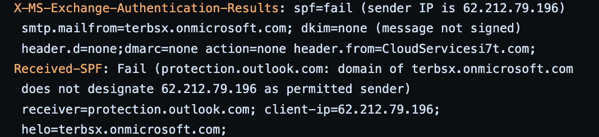
*Fig 5.1 – Authentication results for sender IP 62.212.79.196*

- **SPF:** Fail
- **DKIM:** None (message not signed)
- **DMARC:** None

The envelope sender (`smtp.mailfrom`) claims `terbsx.onmicrosoft.com`, while the `From:` header displayed to the recipient shows `CloudServicesi7t.com` — a mismatch between the authenticated sending domain and the spoofed display domain.

**Other header details:**
```
From:        "Cloud Services" <hello@CloudServicesi7t.com>
Return-Path: t0u2va7hed@terbsx.onmicrosoft.com
```

## 5.3 Sender Identity Assessment

The `.onmicrosoft.com` suffix is a fallback domain assigned to any organization/user registered with Microsoft 365; `terbsx` is the tenant's unique identifier. No useful leads were found correlating this tenant identifier to a known identity, so the sender's exact identity cannot be established through this domain alone.

Critically, `62.212.79.196` fails the SPF check for `terbsx.onmicrosoft.com` — it is not a permitted sender for that domain. On its own this is inconclusive, so infrastructure-level threat intelligence was used to build further confidence (Section 6).

---

# 6. Infrastructure & Threat Intelligence Analysis

## 6.1 Sender IP Reputation (62.212.79.196)

```
Range:        62.212.79.128 – 62.212.79.255 (netname: LEASEWEB)
Controlled by: LeaseWeb Netherlands B.V.
ASN:          AS60781 (Netherlands)
```

The IP was not flagged as malicious by VirusTotal, Cisco Talos, AlienVault OTX, or Spamhaus. However, AbuseIPDB shows **6 prior reports**, several referencing similar phishing campaigns — reinforcing that this IP has a documented history of phishing activity despite a 0% aggregate abuse confidence score.

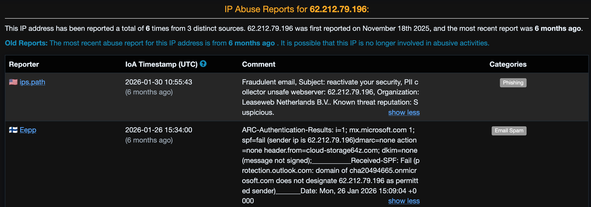
*Fig 6.1 – IP abuse reports for 62.212.79.196 (6 reports from 3 sources; representative Phishing and Email Spam entries shown)

## 6.2 Passive DNS & Associated Domains

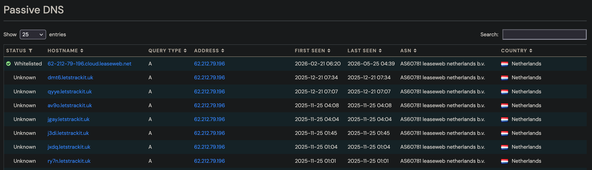
*Fig 6.2 – Passive DNS resolutions for 62.212.79.196 (representative entries; IP resolved to 13 domains total, following a randomized-subdomain pattern)*

This IP has resolved to 13 domains historically, the majority following a pattern of randomized subdomains hosting resources at long, randomly-named paths — consistent with the URL structure observed in this campaign.


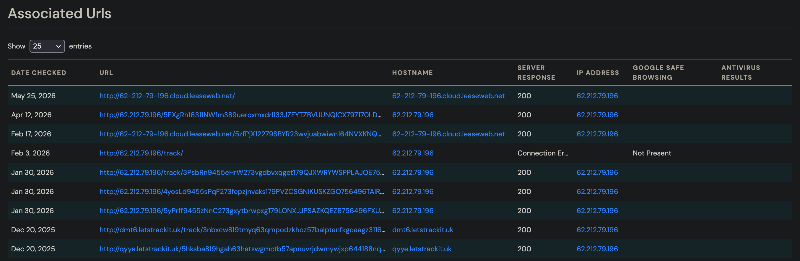
*Fig 6.3 – URLs associated with the identified domains and IP(representative entries showing the recurring randomized-path pattern)*

This pattern aligns with the abuse records above and confirms many of these domains were used in prior phishing campaigns.

## 6.3 Hosting ASN Analysis (AS60781)

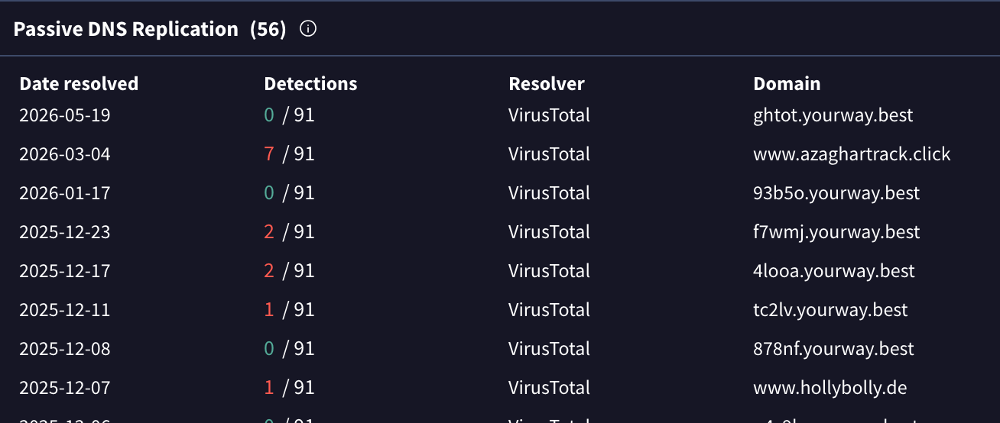
*Fig 6.4 – Passive DNS records for hosting IP 95.211.62.162 (representative entries; VirusTotal, 56 total records)*

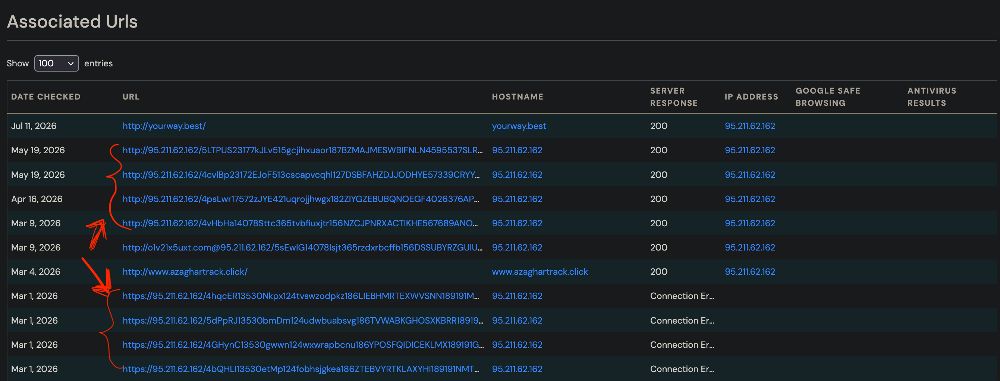
*Fig 6.5 – Historically associated URLs for 95.211.62.162 (representative entries; AlienVault OTX, 232 total records)

These URLs (highlighted) follow the same randomized-token path pattern seen in the current campaign, scanned repeatedly over time — including multiple distinct tokens against the same host scanned on the same day (1 March 2026), indicating active, ongoing abuse rather than a one-off incident.

**WHOIS:**
```
CIDR:          95.211.62.0/23
Net Name:      LEASEWEB-CLOUD-EXPRESS-2
Controlled by: LeaseWeb Netherlands B.V. (MNT: LEASEWEB-NL-MNT)
Route:         95.211.0.0/16 (AS60781)
```

This places the phishing-hosting IP on the **same ASN** as the original sending IP, strengthening the link between sender and hosting infrastructure.

AbuseIPDB shows AS60781 controls 274 IP blocks, many recently reported for abuse — including the two ranges in this investigation, reported 1 week and 10 hours prior to this analysis respectively.

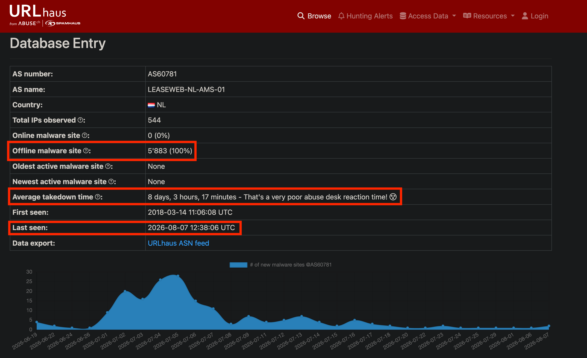
*Fig 6.6 – Malware sites and average takedown time linked to AS60781*

A large number of malware sites have been hosted on this ASN, with an **average takedown time of over 8 days** — a poor abuse-desk response rate. Activity remains current, with the most recent detection dated 7 August 2026.

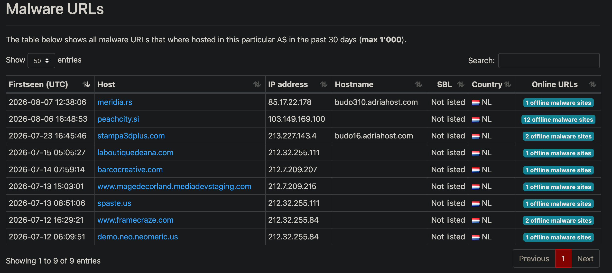
*Fig 6.7 – Domains and IPs associated with malware URLs on AS60781*

## 6.4 Known Malware Families & IOC History

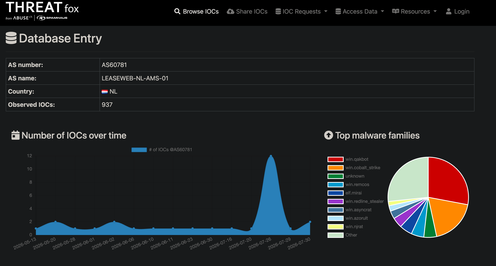
*Fig 6.8 – IOC volume over time and malware families linked to AS60781 (ThreatFox)*

Malware families hosted on this ASN include **Qakbot, Vidar, Remcos RAT, Mirai, AsyncRAT, and RedLine Stealer**, among others.


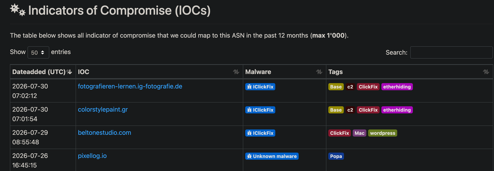
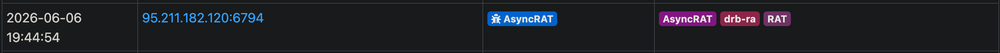
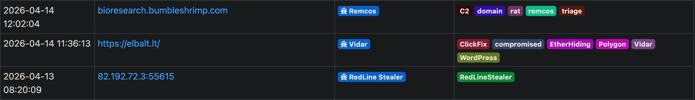
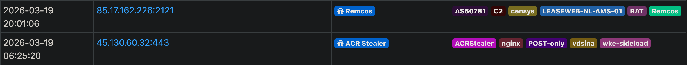
*Fig 6.9 – Recent IOCs associated with AS60781 (representative entries; ClickFix appears repeatedly across the dataset)*


This confirms AS60781 is heavily used for malware distribution and phishing campaigns. Additionally, this ASN has been linked in third-party reporting to **Atomic Stealer**, a significant emerging macOS infostealer/backdoor threat that leverages the **ClickFix** technique — a technique also tagged repeatedly across the IOCs above, further reinforcing the connection.

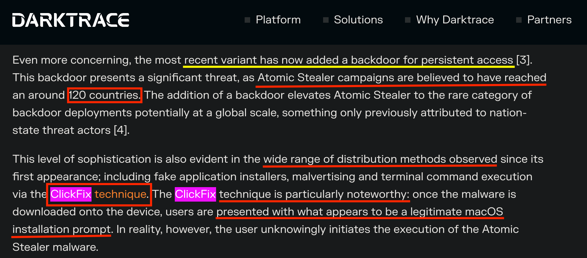
*Fig 6.10 – DarkTrace report on Atomic Stealer and its use of the ClickFix technique*

Source: [DarkTrace – Atomic Stealer: Investigation of a Growing macOS Threat](https://www.darktrace.com/blog/atomic-stealer-darktraces-investigation-of-a-growing-macos-threat)

**Containment action taken at this stage:** Based on the evidence gathered above, the sender IP and hosting infrastructure were blocked immediately (inbound and outbound) pending completion of the full investigation. Full recommendations are consolidated in Section 12.

---

# 7. Email Body & URL Analysis

## 7.1 Tracking Pixel & Link Structure

Initial observations from the email body:

- Contains an embedded tracking pixel.
- All links — the tracking pixel, CTA button, and footer links — communicate with the same obfuscated host, `013764637242`, over HTTP.
- Each link points to a different resource path on that same host, with tokens that appear machine-generated.

**Tracking pixel:**
```

```

**Account recovery button:**
```
href="http://013764637242/4yFfnw17581FgUk421oayiyuovxk80HZUEWAMIRKRZVQY285239TCTQ431794Z8"
```

**Footer links:**
```
href="http://013764637242/5bdgxV17581bUcE421tydidxlijt80CSMOXJMANCHAZAO285239WJMV431794O8"   Privacy Policy
href="http://013764637242/5uKWDG17581BIIS421uimflhazzr80NSYILASVYLGPSOI285239CIXV431794O8"   Unsubscribe
```

The host string `013764637242` does not resolve directly to the sender IP under common numeral-base conversions (hex, octal, decimal); it is a machine-generated obfuscation token rather than an encoded IP.

## 7.2 Resolved Hosting Infrastructure

No threat intelligence platform returned direct hits on the obfuscated URLs themselves. Submitting them for resolution identified the underlying host as **95.211.62.162** — the key pivot point, as this is the actual IP hosting the phishing website (analyzed in Section 6.3).

---

# 8. URL Sandbox / Dynamic Analysis

## 8.1 HTTP Transaction Review

Using urlscan.io, the site behind the "RECOVER ACCOUNT" link (and the other two link paths, which all resolved to the same content) was browsed in a sandboxed environment.

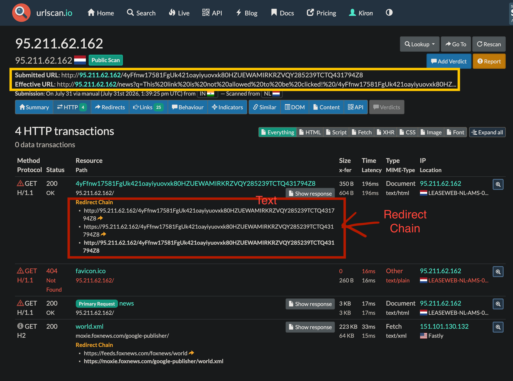
*Fig 8.1 – Effective URL, redirect chain, and HTTP transactions*

Key observations:
- 4 HTTP transactions total: 3 returned 200 OK, 1 returned 404 Not Found.
- The submitted URL and the effective (final) URL differ — the URL changed mid-chain.
- 3 transactions were served from `95.211.62.162`; the final transaction was served from `151.101.130.132`, which belongs to a different ASN and hosts a legitimate news site.

## 8.2 Redirect Chain Behavior

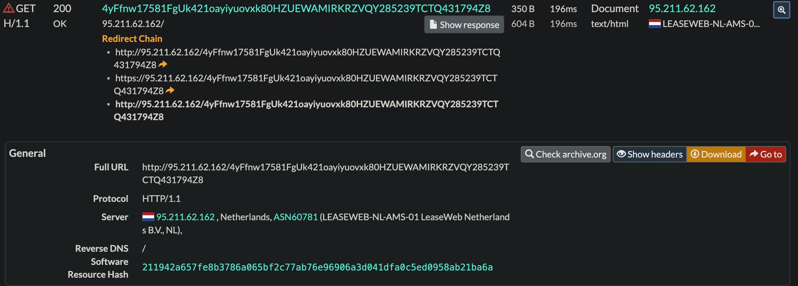
*Fig 8.2 – First request*

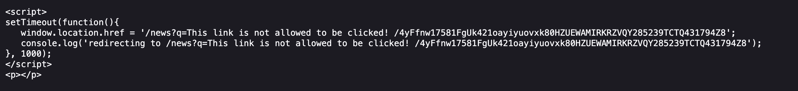
*Fig 8.3 – Response to the first request*

The first request — `http://95.211.62.162/4yFfnw17581FgUk421oayiyuovxk80HZUEWAMIRKRZVQY285239TCTQ431794Z8` — triggers a redirect chain that ultimately loads a script rewriting the URL to:
```
http://95.211.62.162/news?q=This%20link%20is%20not%20allowed%20to%20be%20clicked!%20/4yFfnw17581FgUk421oayiyuovxk80HZUEWAMIRKRZVQY285239TCTQ4317...
```

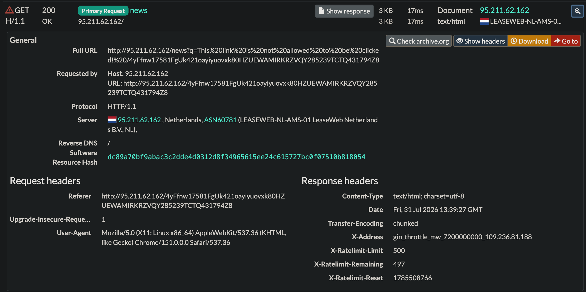
*Fig 8.4 – Third request*

The response is an HTML document containing JavaScript:

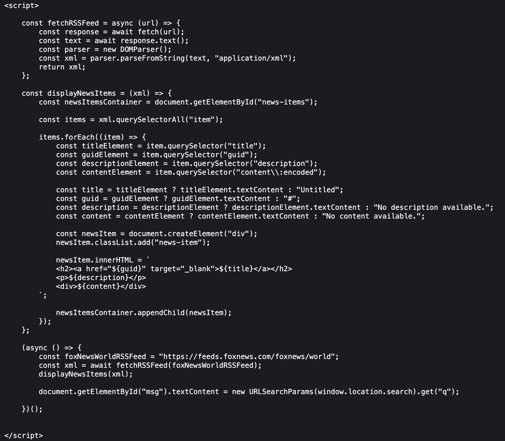
*Fig 8.5 – JavaScript returned in the third response*

This script fetches an RSS feed, parses it, and renders each item as an HTML element — explaining why the site currently displays a benign news feed rather than a credential-harvesting page.

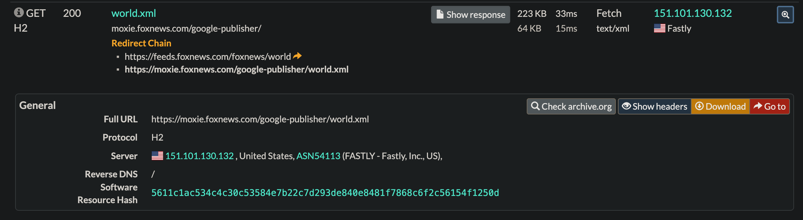
*Fig 8.6 – Fourth request*

The feed URL (`https://feeds.foxnews.com/foxnews/world`) redirects to `https://moxie.foxnews.com/google-publisher/world.xml`, which returns the XML rendered on the page. Historical scans of the same resource around the time the email was sent show the same news-feed content — no earlier credential-harvesting page was recovered.

**Assessment:** The phishing infrastructure appears to have been repurposed or is conditionally serving benign content (e.g., to sandboxed/non-target visitors), rather than being inactive. The absence of an active credential-harvesting page at scan time does not reduce confidence in the phishing determination, given the totality of evidence in Sections 5–7.

## 8.3 Ruled Out: Favicon Hash Analysis

While reviewing the second request (`favicon.ico`, 404 Not Found), the response's SHA-256 resource hash was checked and found to correspond to the hash of an **empty file / zero-length string** — the universal SHA-256 value for zero bytes, which appears in numerous unrelated threat intelligence reports purely because any empty file produces this same hash.

This hash does **not** indicate a favicon file existing with zero bytes, nor that an actual favicon was hashed — it simply reflects an empty HTTP response body. This lead was investigated and correctly **ruled out** as unrelated to the current investigation, rather than treated as a positive indicator.

## 8.4 Anomalous Resource Investigation

Reviewing other domains previously hosted on IP `95.211.62.162`, one related domain — `sakuratempestas.click` — was found to request a suspicious image/png resource via the same randomized-token URL pattern.

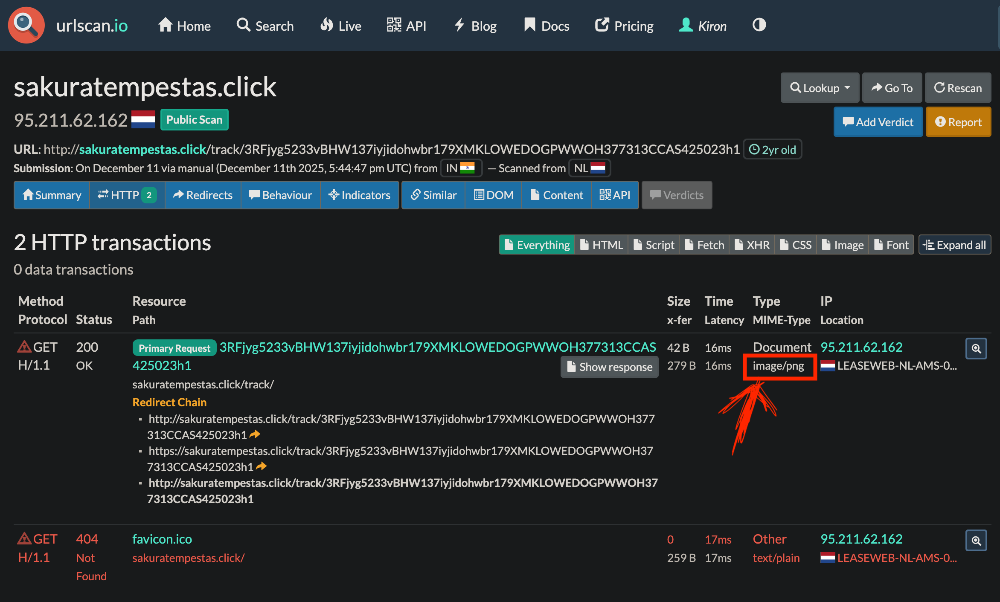
*Fig 8.7 – Request sent to the suspicious resource path*

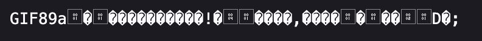
*Fig 8.8 – GIF returned in response*

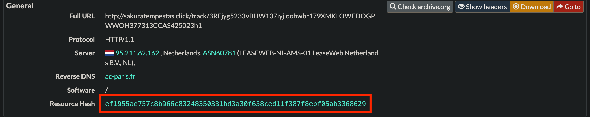
*Fig 8.9 – Resource hash details for the returned GIF*

---

# 9. Threat Attribution

The resource hash identified in Section 8.4 —
```
ef1955ae757c8b966c83248350331bd3a30f658ced11f387f8ebf05ab3368629
```
— was searched against public sources and returned multiple hits from **CISA** and the **U.S. Department of War**, associating it with a known **APT (Advanced Persistent Threat) group**.

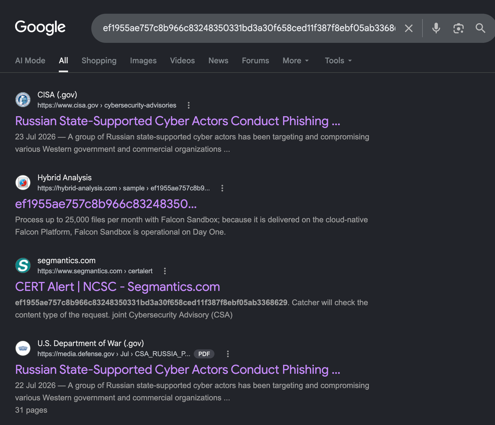
*Fig 9.1 – Search results linking the hash to a CISA cybersecurity advisory*

CISA associates this indicator with phishing campaigns conducted by **Russian state-supported cyber actors**, reinforcing the assessment that this ASN/infrastructure is used to host coordinated phishing campaigns.

Source: [CISA Advisory AA26-204a – Russian State-Supported Cyber Actors Conduct Phishing Campaigns](https://www.cisa.gov/news-events/cybersecurity-advisories/aa26-204a)

> **Confidence note:** This should be treated as a **moderate-confidence correlation**, not confirmed attribution. A single shared hash on shared infrastructure is a meaningful lead but is not, by itself, sufficient to confirm this specific campaign was operated by a state-sponsored actor. Further overlap in TTPs or additional shared IOCs would be needed to raise confidence.

---

# 10. MITRE ATT&CK Mapping

| Technique ID | Name                                            | Evidence                                                                  |
| ------------ | ----------------------------------------------- | ------------------------------------------------------------------------- |
| T1566.002    | Phishing: Spearphishing Link                    | Email body links leading to credential/data-recovery lure                 |
| T1585.001    | Establish Accounts: Social Media/Email Accounts | Fake "Cloud Services" sender persona with spoofed domain                  |
| T1071.001    | Application Layer Protocol: Web Protocols       | HTTP-based redirect chain to phishing/malware-hosting infrastructure      |
| T1204.001    | User Execution: Malicious Link                  | "RECOVER MY ACCOUNT NOW" CTA relies on user click                         |
| T1090        | Proxy / Redirect Infrastructure                 | Multi-hop redirect chain observed in urlscan.io HTTP transaction analysis |

---

# 11. Indicators of Compromise (IOC Summary)

| Type | Indicator | Context |
|---|---|---|
| Sender IP | `62.212.79.196` | SPF fail; AS60781; prior AbuseIPDB phishing/spam reports |
| Sender domain (envelope) | `terbsx.onmicrosoft.com` | smtp.mailfrom; return-path domain |
| Sender domain (display) | `CloudServicesi7t.com` | Spoofed From: header, no matching legitimate company |
| Phishing hosting IP | `95.211.62.162` | Resolves obfuscated numeric host string used in email body links |
| Obfuscated host string | `013764637242` | Encoded reference to 95.211.62.162 used across all email links |
| Hosting ASN | AS60781 (LEASEWEB-NL-AMS-01) | Hosts sender IP and phishing IP; linked to Qakbot, Cobalt Strike, Remcos, AsyncRAT, RedLine Stealer, Mirai |
| Related malicious domain (same ASN pattern) | `sakuratempestas.click` | Same randomized-token URL pattern; served suspicious img/png resource |
| File hash (SHA-256) | `ef1955ae757c8b966c83248350331bd3a30f658ced11f387f8ebf05ab3368629` | Retrieved from related infra on same ASN; matches CISA advisory AA26-204a (Russian state-sponsored phishing) |
| Tracking pixel path pattern | `/track/<random-token>` on host `013764637242` | Used for open/click tracking in email body |

---

# 12. Conclusion & Recommendations

**Conclusion:** This email is a confirmed **true-positive phishing attempt**, supported by failed email authentication, a spoofed sender domain, infrastructure with an extensive documented history of phishing and malware hosting (AS60781), and a moderate-confidence correlation to a CISA advisory on Russian state-linked phishing activity.

**Recommendations:**

1. **Block** IP addresses `62.212.79.196` and `95.211.62.162` at the email gateway and network perimeter (inbound and outbound).
2. **Block/monitor** for domains and URL patterns matching the obfuscated host `013764637242` and related randomized-token paths.
3. **Submit IOCs** to internal threat intel platforms and relevant sharing communities (e.g., AbuseIPDB, URLhaus) if not already reported.
4. **Retro-hunt** mail logs for other messages from `terbsx.onmicrosoft.com` or displaying `CloudServicesi7t.com`, and for any other messages originating from AS60781-hosted senders.
5. **User awareness:** notify staff of this campaign's specific lure (fake storage/subscription deletion notice) given its urgency-based social engineering approach.
6. **Attribution handling:** treat the possible link to CISA advisory AA26-204a (Russian state-sponsored activity) as a moderate-confidence lead for further correlation, not as confirmed attribution, pending additional overlapping IOCs or TTPs.
